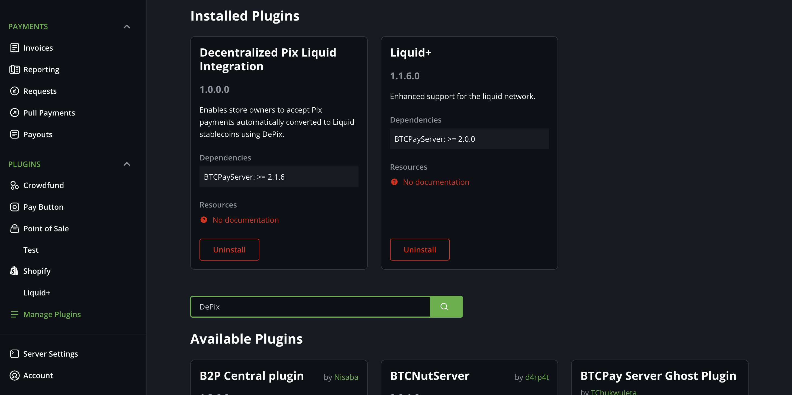
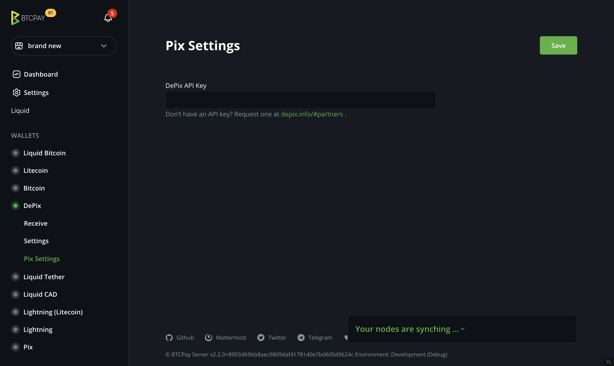
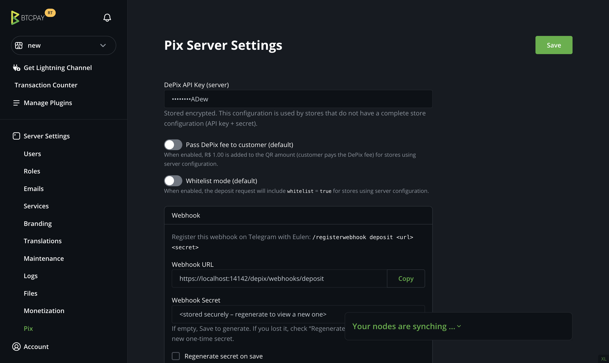
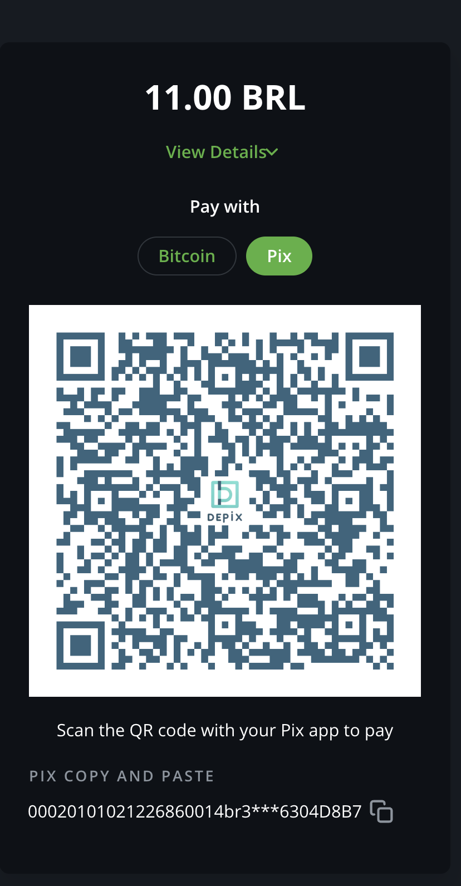

# DePix Plugin for BTCPay Server

Accept **Pix** payments in your BTCPay Server store and receive funds in **DePix** (a Liquid-based BRL stablecoin). This guide is written for BTCPay store owners and server admins and focuses on setup and day-to-day use.

---

## What it does

* Adds Liquid Network Stablecoin **DePix** as a payment method to your BTCPay store.
* Adds **Pix** as a payment method to your BTCPay store (via DePix).
* After you save a valid DePix configuration, Pix can be enabled and appears on newly created invoices (from **Invoices**) and in your **Point of Sale (POS)** apps.
* Provides a **Pix Transactions** page to monitor deposits and statuses.
* Funds settle to your **DePix (Liquid) wallet**.

> Community plugin. Not affiliated with BTCPay Server or DePix. It’s new, so treat it as experimental for now. Feedback is welcome!

---

## Requirements

* BTCPay Server 2.x
* A **DePix partner API key** — request at https://www.depix.info/#partners

---

## Installation

1. Install the plugin in BTCPay (Plugins → Manage Plugins → search for DePix).
2. Restart BTCPay when prompted.



> When installed, the DePix (Liquid) asset is prepared for your store. You only need to create your DePix wallet and configure DePix (store-level or server-level) to enable Pix payments.

---

## Create your DePix wallet (choose one)

### Option A — External (Aqua via SamRock Plugin, xpub import)

1) In BTCPay: Plugins → Manage Plugins → install **SamRock**; open SamRock and **scan** the pairing QR with the **Aqua** app.
2) **Wallets** → **Liquid Bitcoin** → **Settings** → **Derivation Scheme** → **copy the LBTC xpub**.
3) **Wallets → DePix → Connect an existing wallet → Enter extended public key** → paste the LBTC xpub → Continue.

Result: BTCPay derives Liquid/DePix receiving addresses from this xpub, so **deposits go directly to your Aqua wallet**.  
(Only the **public** key is used; no private keys leave Aqua.)

### Option B — BTCPay Hot Wallet

1) **Wallets → DePix → Create new wallet → Hot wallet**.
2) To spend from your own Elements/Liquid node later, import the generated keys using **Liquid+** and `elements-cli` (see **Balance and spending DePix**).

---

## Configuration scopes (Store vs Server)

DePix can be configured in one of two places:

### Store configuration (recommended for most users)
Path: **Wallets → Pix → Settings**

Use this when:
- You want store-specific behavior (fee/whitelist) and full control at store level, or
- Your server admin did not configure DePix globally.

### Server configuration (optional, for server admins)
Path: **Server Settings → Pix (Pix Server Settings)**

Use this when:
- You run a BTCPay Server instance and want a **default configuration** for many stores with same API Key and Webhook.

### Precedence (what gets used)
- If the store has a complete **store configuration** (API key + webhook secret), **store config is used**.
- Otherwise, if the server has a complete **server configuration**, **server config is used**.
- If neither exists, Pix cannot be enabled.

> When a store is using **server configuration**, the store does not manage webhook secrets. Webhook registration is handled by the server admin.

---

## Store setup (Wallets → Pix → Settings)

1. Go to **Wallets → Pix → Settings**
2. Paste your **DePix API key** and click **Save**
3. (Optional) Configure store behavior (only applies when the store has its own API key):
   - **Pass fee to customer**
   - **Whitelist mode**



---

## Server-wide setup (Server Settings → Pix)

This is for BTCPay Server admins who want to configure DePix once and let stores inherit it.

1. Go to **Server Settings → Pix (Pix Server Settings)**
2. Paste the **server DePix API key** and click **Save**
3. Configure defaults for stores that rely on server config:
   - **Pass fee to customer**
   - **Whitelist mode**



---

## Webhook registration (same flow for Store or Server)

After you click **Save** (either in **store settings** or **server settings**), the page will show:

- **Webhook URL**
- **One-time secret**
- A ready-to-copy **Telegram command**

**Do this immediately:** copy the Telegram command **before refreshing or leaving the page**.  
The secret is **one-time view**. If you miss it, you must **Regenerate secret** and click **Save** again.

In the DePix Telegram bot (Eulen), run the command exactly as shown on the page.

Notes:
> Stores using server configuration do not have access to the server secret. The server admin should register the webhook.

---

## Using it

* **Invoices**: create an invoice as usual; customers will see **Pix** as a payment method.
* **POS**: generate charges from your Point of Sale; Pix is available.



* **Transactions**: go to **Wallets → Pix** to track Pix deposits (status, ID, amount, time, etc.).
* **DePix Balance**: go to **Wallets → DePix** to track the received DePix converted from successful Pix transactions.

---

## Balance and spending DePix

After a Pix payment, funds settle to your **DePix (Liquid) wallet**.

### Which setup are you using?

- **SamRock + Aqua (xpub)**: funds go to your **Aqua wallet**. Spend them normally from Aqua — you **do not** need Liquid+ or `elements-cli`.
- **BTCPay Hot Wallet**: follow the steps below to spend via your **Elements/Liquid node** (Liquid+).

---
### Spend DePix from a BTCPay Hot Wallet (Liquid+ + elements-cli)
1. Install the **Liquid+** plugin in BTCPay Server.
2. Click on Liquid at the sidebar under the Store Settings.
3. Use Liquid+ to run the key imports on your Elements/Liquid node:

   * `importprivkey <WIF_PRIVATE_KEY>`
   * `importblindingkey <ADDRESS> <BLINDING_KEY>`

   > Import every address you plan to spend from. If you generated a new address in BTCPay, import its **privkey** and **blinding key**.
4. **Rescan** the chain so the wallet finds past UTXOs belonging to those keys (faster if you know an approximate start height):

   ```bash
   elements-cli rescanblockchain 0
   ```

   You can pass a higher start height to speed things up, e.g. `rescanblockchain 120000`.
5. **Verify your balance**:

   ```bash
   elements-cli getbalances
   ```

   (DePix Asset ID: 02f22f8d9c76ab41661a2729e4752e2c5d1a263012141b86ea98af5472df5189)
6. **Send DePix** using `sendtoaddress` with the asset id that shown in getbalances as the last argument:

   ```bash
   elements-cli sendtoaddress "<DEST_LIQUID_ADDRESS>" <AMOUNT> "" "" false false null null null "<DEPix_ASSET_ID>"
   ```

   This constructs and broadcasts a confidential transaction of the specified **asset** (DePix) to the destination so you can swap for BTC.

**Notes**

* **Fees** are paid in **L-BTC** on Liquid. Keep a small L-BTC balance in the same wallet to cover network fees.

---

## FAQ

**Where do I get the DePix API key?**
At [https://www.depix.info/#partners](https://www.depix.info/#partners)

**Is the webhook mandatory?**
No, but it’s **recommended** so you receive real‑time payment updates.

**Pix doesn’t appear as a payment method. What should I check?**
Make sure DePix is configured either in Wallets → Pix → Settings (store) or by the server admin in Server Settings → DePix (server). Once a complete configuration exists, Pix can be enabled and will appear on invoices/POS.

---

## Support & feedback

Open an **issue** on the repository with details of your problem or suggestion. Pull requests are welcome.

## License

MIT.
