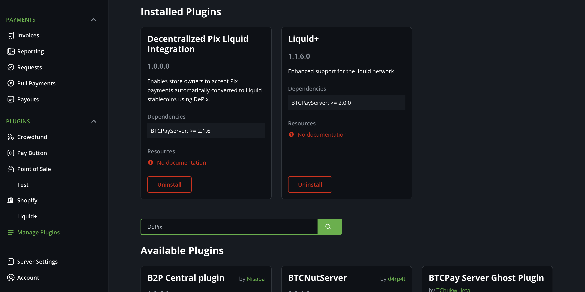

# DePix Plugin for BTCPay Server

Accept **Pix** payments in your BTCPay Server store and receive funds in **DePix**, a Liquid-based BRL stablecoin.

> Community plugin. Not affiliated with BTCPay Server or DePix. Treat it as experimental for now. Feedback is welcome.

## What It Does

* Adds Liquid Network Stablecoin **DePix** as a payment method.
* Adds **Pix** as a payment method through DePix.
* Creates Pix deposit QR codes for compliant invoices and POS checkouts.
* Provides a **Pix Transactions** page to monitor deposits and statuses.
* Settles funds to your **DePix (Liquid) wallet**.



## Requirements

* BTCPay Server 2.x
* A **DePix partner API key** from [depix.info](https://www.depix.info/#partners)

## Quick Start

1. Install the plugin in BTCPay: **Plugins -> Manage Plugins -> DePix**.
2. Restart BTCPay when prompted.
3. Create or connect your **DePix wallet**.
4. Configure Pix in **Wallets -> Pix -> Settings**, or use server-wide configuration from **Server Settings -> Pix**.
5. Register the webhook in the DePix Telegram bot using the command shown after saving settings.
6. Make sure invoices and POS forms provide payer CPF/CNPJ as `endUserTaxNumber`.

Full setup details are in [Configuration](docs/configuration.md).

## Checkout Requirement

Eulen requires every Pix deposit QR code to identify the payer. This plugin sends the payer CPF/CNPJ to `/deposit` as `endUserTaxNumber`.

Send CPF/CNPJ as a JSON string, not a number, because valid CPF/CNPJ values can start with `0`:

```json
{
  "endUserTaxNumber": "01234567890"
}
```

Formatted values such as `012.345.678-90` and `12.345.678/0001-95` are accepted. The plugin removes the mask and sends only digits to Eulen.

Pix will be unavailable for an invoice if `endUserTaxNumber` is missing, blank, or sent as a JSON number.

See [Checkout Requirements](docs/checkout-requirements.md) for invoice, API, and POS behavior.

## Documentation

* [Configuration](docs/configuration.md): wallet setup, store/server settings, split payments, and webhook registration.
* [Checkout Requirements](docs/checkout-requirements.md): Eulen compliance, `endUserTaxNumber`, invoices, API, and POS forms.
* [P2P Mode](docs/p2p.md): selling DePix through the plugin-owned P2P POS.
* [Spending DePix](docs/spending-depix.md): Aqua/SamRock, hot wallet, Liquid+, and `elements-cli`.

## Screenshots


## FAQ

**Where do I get the DePix API key?**

Request one at [https://www.depix.info/#partners](https://www.depix.info/#partners).

**Is the webhook mandatory?**

No, but it is recommended so you receive real-time payment updates.

**Pix does not appear as a payment method. What should I check?**

Make sure DePix is configured either at store level or server level. For each invoice, make sure payer CPF/CNPJ is available as a string in `endUserTaxNumber`.

## Support

Open an issue with details of your problem or suggestion. Pull requests are welcome.

For anything related to the DePix plugin, join the [Telegram group](https://t.me/+xFiXWiZPAQ05O).

## License

MIT.
