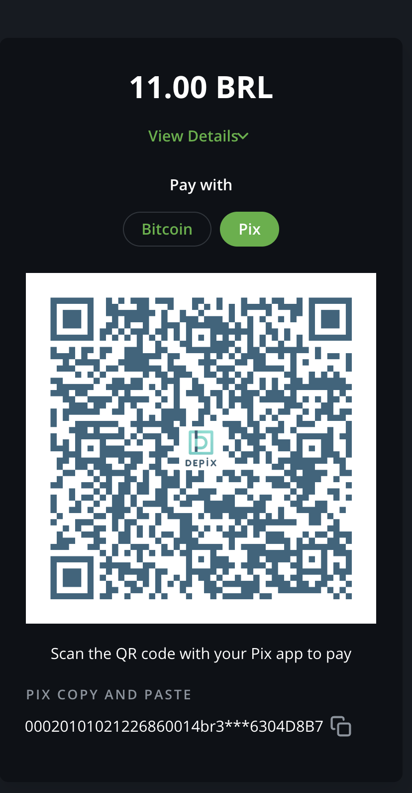

# Checkout Requirements

Eulen requires every Pix deposit QR code to identify the payer. The plugin satisfies this by sending the payer CPF/CNPJ to `/deposit` as `endUserTaxNumber`.

## Required Field

Use the exact field name:

```text
endUserTaxNumber
```

The value must be a JSON string:

```json
{
  "endUserTaxNumber": "01234567890"
}
```

Do not send CPF/CNPJ as a JSON number. Valid CPF/CNPJ values can start with `0`, and numeric serialization can remove leading zeros.

Formatted values such as `012.345.678-90` and `12.345.678/0001-95` are accepted. The plugin removes the mask and sends only digits to Eulen. It does not validate CPF/CNPJ format locally; Eulen/Pix validates the value.

The plugin does not require `endUserFullName` and does not send EUID.

## Invoices And API

For API-created or manually created invoices, include `endUserTaxNumber` in invoice metadata as a string:

```json
{
  "metadata": {
    "endUserTaxNumber": "01234567890"
  }
}
```

Pix will be unavailable for the invoice if the value is missing, blank, or sent as a JSON number.

## POS Forms

For regular POS checkouts, the invoice must include a form response with a required field named exactly `endUserTaxNumber`.

When Pix is enabled, the plugin checks the store forms:

* If any existing form already has required `endUserTaxNumber`, the plugin does not create another form.
* If no compatible form exists, the plugin creates **DePix payer identification**.
* If **DePix payer identification** already exists but is missing the required field, the plugin repairs that form.

The plugin does not attach **DePix payer identification** to an existing POS automatically. Store owners can either attach that form to their POS or add a required `endUserTaxNumber` field to their existing checkout form.

## Transactions And Balance

After a compliant Pix payment is created, customers see Pix as a payment method on the invoice.

* Go to **Wallets -> Pix** to track Pix deposits, status, ID, amount, and time.
* Go to **Wallets -> DePix** to track received DePix after successful Pix transactions.


