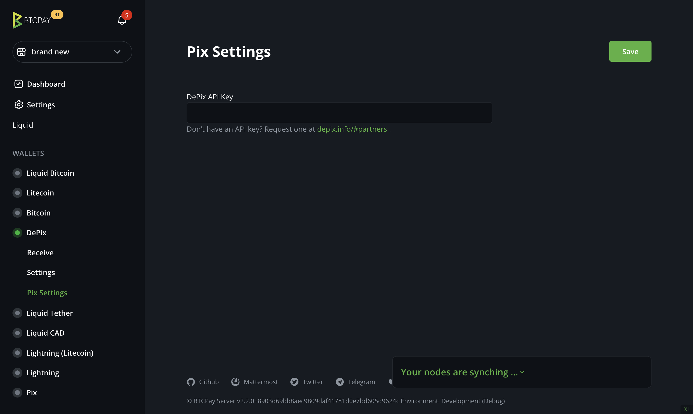
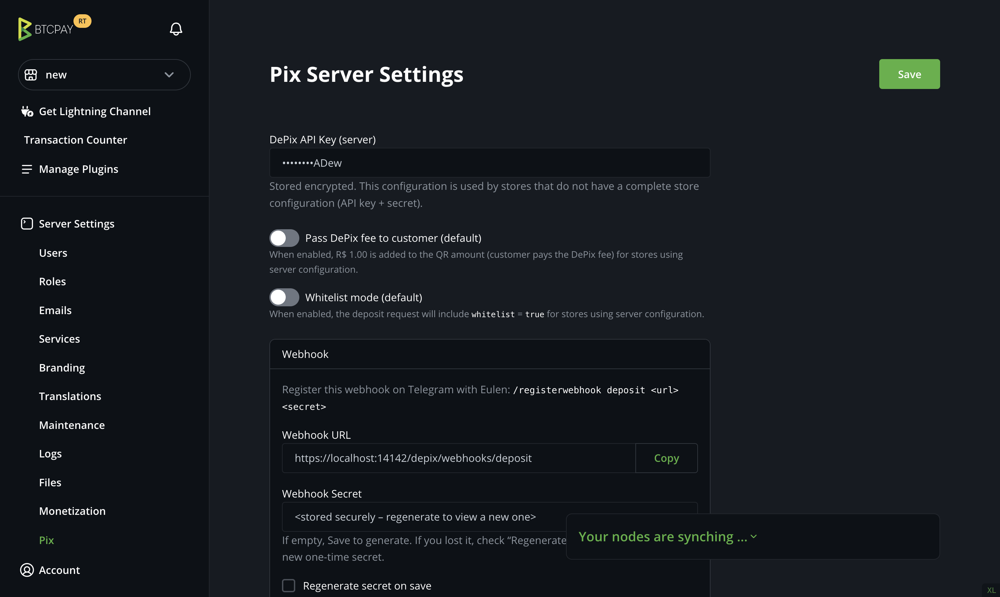

# Configuration

This page covers wallet setup, Pix configuration, split payments, and webhook registration.

## Create Your DePix Wallet

Choose one wallet setup before enabling Pix.

### Option A: External Aqua Wallet Through SamRock

1. In BTCPay, install **SamRock** from **Plugins -> Manage Plugins**.
2. Open SamRock and scan the pairing QR with the **Aqua** app.
3. Go to **Wallets -> Liquid Bitcoin -> Settings -> Derivation Scheme** and copy the LBTC xpub.
4. Go to **Wallets -> DePix -> Connect an existing wallet -> Enter extended public key**.
5. Paste the LBTC xpub and continue.

BTCPay derives Liquid/DePix receiving addresses from this xpub, so deposits go directly to your Aqua wallet. Only the public key is used; no private keys leave Aqua.

### Option B: BTCPay Hot Wallet

1. Go to **Wallets -> DePix -> Create new wallet -> Hot wallet**.
2. To spend from your own Elements/Liquid node later, import the generated keys using Liquid+ and `elements-cli`.

See [Spending DePix](spending-depix.md) for the spending flow.

## Configuration Scopes

DePix can be configured at store level or server level.

### Store Configuration

Path: **Wallets -> Pix -> Settings**

Use this when:

* You want store-specific behavior such as fee and whitelist settings.
* Your server admin did not configure DePix globally.

### Server Configuration

Path: **Server Settings -> Pix**

Use this when you run a BTCPay Server instance and want a default DePix configuration for many stores.

### Precedence

* If the store has a complete store configuration, store configuration is used.
* Otherwise, if the server has a complete server configuration, server configuration is used.
* If neither exists, Pix cannot be enabled.

When a store uses server configuration, the store does not manage webhook secrets. Webhook registration is handled by the server admin.

## Store Setup

1. Go to **Wallets -> Pix -> Settings**.
2. Paste your **DePix API key** and click **Save**.
3. Optionally configure store behavior:
   * **Pass fee to customer**
   * **Whitelist mode**
4. Optionally configure split payments:
   * **DePix Split Address**: wallet that receives the split portion.
   * **Split Fee**: percentage of the Pix amount sent to the split address.
   * Both fields are required together; leave both empty to disable split.

## Split Payment Use Cases

* **Merchant gateway**: provide Pix through your Eulen API and charge a platform fee.
* **Affiliates**: automatically send a commission to an affiliate wallet per sale.
* **Coproduction**: split course sales between producer and coproducer wallets.
* **Marketplace**: route a platform fee to your wallet while the seller receives the rest.
* **Local partnerships**: split revenue between venue and service partner.

## Server-Wide Setup

1. Go to **Server Settings -> Pix**.
2. Paste the **server DePix API key** and click **Save**.
3. Configure defaults for stores that rely on server configuration:
   * **Pass fee to customer**
   * **Whitelist mode**

## Webhook Registration

After you click **Save** in store settings or server settings, the page shows:

* **Webhook URL**
* **One-time secret**
* A ready-to-copy **Telegram command**

Copy the Telegram command before refreshing or leaving the page. The secret is shown only once. If you miss it, regenerate the secret and save again.

In the DePix Telegram bot, run the command exactly as shown.

Stores using server configuration do not have access to the server secret. The server admin should register the webhook.
